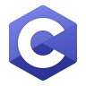
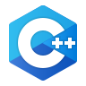
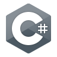
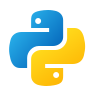
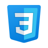

  

  

<h2>👤 Profile</h2>

  <strong>이름</strong>　김민주 (MINJU KIM) 
   
  <strong>전공</strong>　컴퓨터공학 
   
  <strong>관심 분야</strong>　IoT·임베디드 SW, 백엔드 시스템 및 AI 응용 개발 
   
  <strong>이메일</strong>　
  <a href="mailto:cheong7394wol@gmail.com">cheong7394wol@gmail.com</a>

 

<h2>🛠️ Tech Stack</h2>

<h3>Languages</h3>

  
  
  
  
  
  
  

<h3>Embedded & IoT</h3>

  
  
  
  

<h3>Application & Backend</h3>

  
  
  
  

<h3>AI & Vision</h3>

  
  
  

<h3>Database</h3>

  

<h3>Tools</h3>

  
  
  
  
  
  
  
  
  

<h2>📋 Core Skills</h2>

  <strong>C / C++</strong>　객체지향 설계, STL 자료구조 활용 및 물류 분류 시뮬레이션 구현 
   
  <strong>C# / .NET</strong>　WPF·WinForms 애플리케이션 및 ASP.NET Core REST API 개발 
   
  <strong>Embedded / IoT</strong>　Raspberry Pi·Arduino 기반 센서 수집과 장치 제어 
   
  <strong>Python / AI</strong>　OpenCV·YOLO를 활용한 이미지·영상 객체 인식 기능 구현 
   
  <strong>Database</strong>　MySQL 테이블 설계 및 CRUD·JOIN 기반 데이터 처리

 

### 프로젝트 리스트

- [WPF] [OpenAPI CCTV 모니터링앱](https://github.com/Haluey/iot-dotnet-2026/blob/main/TOYPROJECT1.md)

### Contribution

